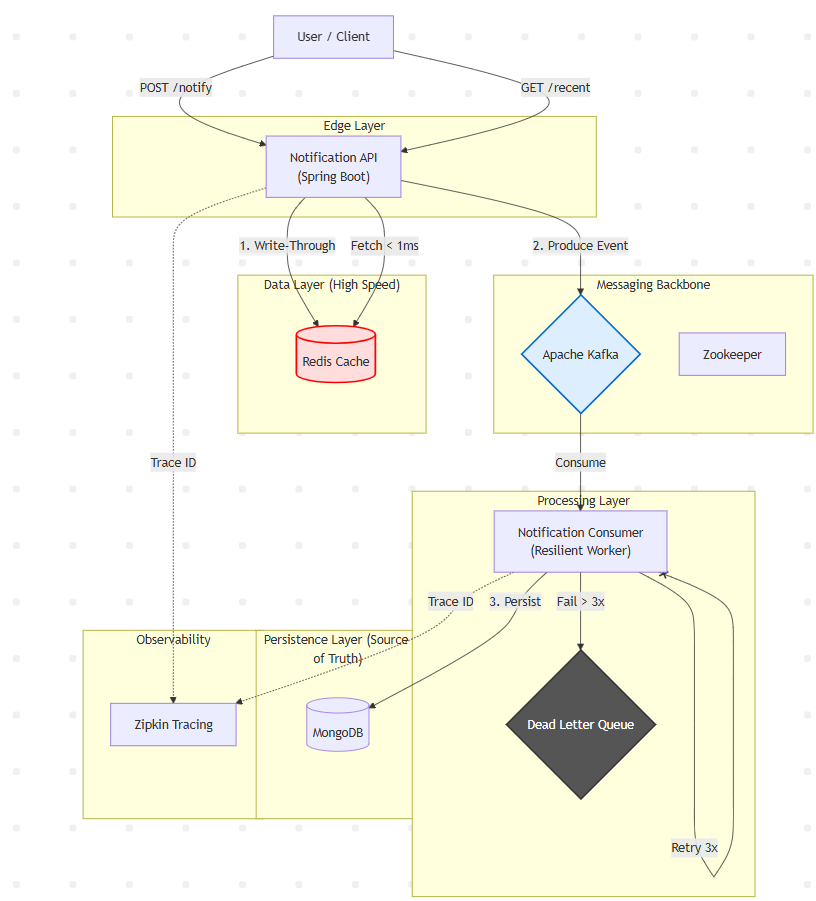

# 🌊 StreamFlow - Distributed Notification Engine


**StreamFlow** is a production-grade, fault-tolerant notification engine designed for high throughput and low latency. It implements a **Write-Through Caching** strategy with **Redis** for instant reads, **Apache Kafka** for asynchronous decoupling, and **Zipkin** for distributed tracing.

It features a robust **Resilience Strategy** (Circuit Breaker & DLQ) to ensure **Zero Data Loss** during traffic spikes or downstream failures.

## 🚀 Tech Stack (The "Top 10%" Stack)
- **Core:** Java 17, Spring Boot 3.4
- **Messaging:** Apache Kafka (Event-Driven Architecture)
- **Caching:** Redis (Write-Through Pattern for sub-millisecond reads)
- **Database:** MongoDB (NoSQL Persistence)
- **Resilience:** Spring Retry (Exponential Backoff) & Dead Letter Queues (DLQ)
- **Observability:** Zipkin (Distributed Tracing & Latency Monitoring)
- **Testing:** Testcontainers (Integration Testing with real Docker infra)
- **CI/CD:** GitHub Actions (Multi-Stage Docker Builds)

## 🏗️ System Architecture

The system splits traffic into a **Fast Read Path** (served from Memory) and a **Reliable Write Path** (processed Asynchronously).



### Key Features Implemented

1.  **Write-Through Caching (Redis):**
    * Recent notifications are cached in Redis immediately upon receipt.
    * **Impact:** Reduces database load and enables **O(1)** read time for recent alerts.

2.  **Resilience & Fault Tolerance:**
    * **Retry Policy:** 3 attempts with Exponential Backoff (1s, 2s, 4s) for transient network blips.
    * **Dead Letter Queue (DLQ):** Poison pill messages are automatically routed to `notifications-dlq` after retries fail, ensuring no message is ever lost.

3.  **Observability (Zipkin):**
    * Full request tracing across microservices.
    * Visualize latency breakdowns: `API -> Kafka -> Consumer -> Mongo`.

4.  **Production-Grade Testing:**
    * Uses **Testcontainers** to spin up *actual* Kafka and MongoDB instances during tests.
    * No mocks for infrastructure components—guarantees code works in the real world.

## 🛠️ How to Run

### Prerequisites
* Docker & Docker Compose (That's it. No local Java/Mongo needed).

### 1. Start Infrastructure & App
We use a unified Docker environment for Kafka, Zookeeper, Mongo, Redis, and Zipkin.

```bash
docker-compose up -d
```

### 2. Run the Service
```bash
cd core/core
./mvnw clean spring-boot:run
```

### 3. Explore
* **Swagger API:** [http://localhost:9090/swagger-ui.html](http://localhost:9090/swagger-ui.html)
* **Zipkin Dashboard:** [http://localhost:9411](http://localhost:9411) (Check traces)

-----

## 🧪 Testing & Verification

### Integration Tests (Testcontainers)
Run the full suite which spins up ephemeral Docker containers:
```bash
./mvnw clean verify
```

### API Endpoints

| Method | Endpoint | Description | SLA |
| :--- | :--- | :--- | :--- |
| `POST` | `/api/notify` | Triggers event. Writes to Redis + Kafka. | Async (Fast) |
| `GET` | `/api/notify/recent` | Fetches latest 10 notifications from Redis. | **< 5ms** |

## 👨‍💻 Author
**Mohd Arshad**
*Backend Engineer specializing in Distributed Systems.*